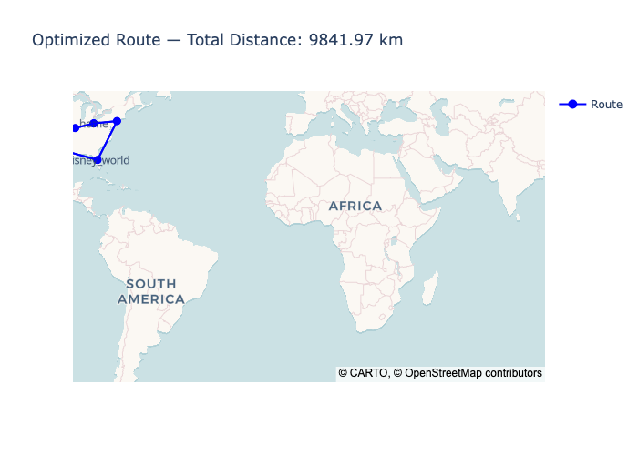
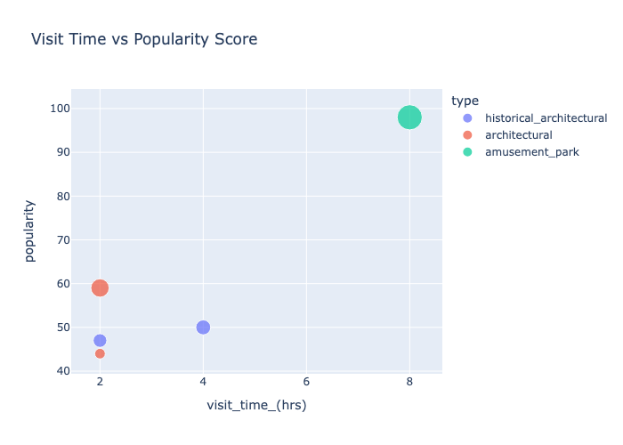

# Sightseeing Route Optimization: Landmark-Based Roadtrip Planner  

## Project Overview  
This project focuses on building a data-driven roadtrip planner that generates optimized travel routes through popular landmarks and natural attractions. Using real-world data—such as visitor reviews, photo counts, and annual visitor statistics—the system ranks each landmark with a calculated popularity score and suggests the optimal time travelers might spend at each location.  

## Objective  
Since landmarks differ in popularity and typical visit time, the goal of this project is to create optimized routes that minimize total travel distance while ensuring each landmark is visited only once. By developing a model that recommends the most efficient visiting order based on a user’s starting point, the project helps travelers discover must-see attractions, maximize sightseeing time, and avoid unnecessary travel.  

## What Was Done (Methodology & Techniques)  

### Data Preprocessing and Feature Engineering  
Landmark popularity scores were calculated using a weighted formula that includes average user rating, reviews/photos, and annual visitor counts. The dataset was cleaned and standardized to ensure consistency in analysis.  

### Distance Calculation  
A custom implementation of the Haversine formula was used to compute distances between landmarks based on their latitude and longitude. This formula was integrated into the `compute_total_distance` function for reuse across models.  

### Baseline Model  
A random route generator served as a baseline for comparison. This model randomly selected the next landmark in the route and computed the total distance traveled.  

### Route Optimization  
Two route optimization approaches were implemented: a greedy nearest neighbor algorithm for quick estimation and a brute-force permutation model to identify the shortest possible route for smaller datasets. Both approaches ensured landmarks were visited once, starting and ending at the defined home location.  

### Visualization and User Interaction  
Interactive visualizations were built using Plotly to enhance user experience and understanding of the model outputs. The visualizations included maps, scatter plots, and bar charts designed to highlight key insights.  

## Visual Insights  

**1. Interactive Route Map with Landmark Details**  
The map below visualizes the optimized route. Each landmark is marked with a pop-up that displays its name, type, suggested visit time, popularity score, and the distance to the next stop. The route is drawn as connecting lines between the landmarks, with hover text showing the exact distance for each leg of the trip. This visualization helps users quickly understand both the sequence of visits and the overall route efficiency.  

  

**2. Visit Time vs. Popularity Score Scatter Plot**  
This scatter plot shows the relationship between how long visitors typically spend at a landmark and its popularity score. Each point represents a landmark, color-coded by type, with bubble size reflecting engagement factors like reviews or photos. The chart allows users to compare attractions based on popularity and visit duration, offering insights into how to prioritize stops when planning a trip.  

  

## Performance and Results  
The time required for route optimization was measured using Python’s `time` module. Both baseline and optimized routes were compared in terms of total distance and computation time, giving a clear view of the model's efficiency improvements.  

## Business Value & Future Improvements  

**Business Outcomes:**  
- Provides travelers with a tool for efficient and customized sightseeing  
- Supports travel planners and agencies in itinerary optimization  
- Delivers a data-backed approach to enhancing trip planning with visual insights  

**Next Steps:**  
- Deploy the planner as an interactive web app using React  
- Integrate external data sources like traffic and weather for smarter route suggestions  
- Explore advanced optimization algorithms for handling larger landmark datasets  

## Repository Structure  
```
├─ data_science
├── .ipynb_checkpoints
├── images/  
│   ├── baseline_route.png  
│   └── optimized_route.png
│   └── popular_route.png
│   └── top5landmarks.png
│   └── visit_popular.png  
├── Landmark_Dataset_with_Visit_Time_and_Popularity_Factors.csv
├── README.md 
├── landmarks.csv
├── python_code_for_engineers.py
├── roadtrip_project.ipynb   
├── sightseeing_project.ipynb  
```

## Technologies Used  
- Python  
- Pandas, Plotly, Geopy, Math  
- Jupyter Notebook  

## Contact  
Created by 
Victor Forman | LinkedIn: https://www.linkedin.com/in/victor-forman-9687b1a9/ 
Sabrina McField | sabrinamcfield@gmail.com | LinkedIn: https://www.linkedin.com/in/sabrina-mcfield/
  
